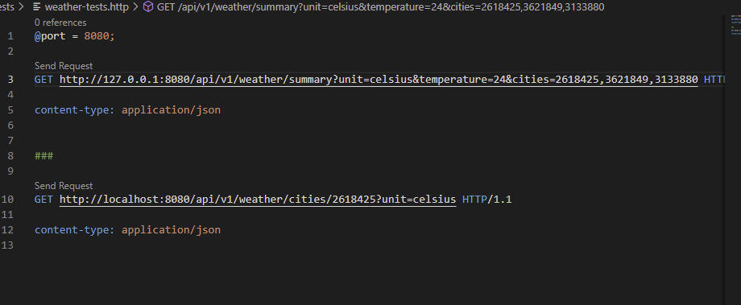

# favorite-city-weather
city weather api in node.js typescript, fastify


# Introduction

A Company needs to build a weather api for its mobile apps. 

It should be written in TypeScript and preferably use wellknown frameworks. 
The company has chosen to use OpenWeather API as its weather forecast provider, so the task is to 
consume forecasts from Open weather API and reformat data to suite the need of the consuming mobile apps.
As an extra requirement, the api needs to be ratelimited to 10000requests per day.


Therefore

We will use

* TypeScript
* Fastify api
* [Open weather api](https://openweathermap.org/forecast5#cityid5)


# Getting started

We assume node is installed. 
We assume that REST Client plugin has been isntalled in VSCODE.

> IMPORTANT You need to obtain your own openweather api key and replace it in \shared\configuration.ts

* clone repository
* run ``` npm install ``` 
* in visual studio code press F5 to debug
* use the weather-test.http file to mke requests to the two endpoints



## testing rate limiting

```typescript
server.register(import("@fastify/rate-limit"), {
  max: 5,
  timeWindow: "1 minute",
});
```

by setting max to only 5 and timeWindow to 1 minute
We can simply manually press the send request link in weather-tests.http more than  times and we get the expected error response

```json
HTTP/1.1 429 Too Many Requests
x-ratelimit-limit: 5
x-ratelimit-remaining: 0
x-ratelimit-reset: 51
retry-after: 60000
content-type: application/json; charset=utf-8
content-length: 97
Date: Tue, 20 Dec 2022 10:05:35 GMT
Connection: close

{
  "statusCode": 429,
  "error": "Too Many Requests",
  "message": "Rate limit exceeded, retry in 1 minute"
}
```

We can set the rate limit to what strategy wee desire see [documentation at fastify ratelimit](https://github.com/fastify/fastify-rate-limit) 

# Solution considerations


## project and typescript setup
We will setup a folder/ porject in visual studio code.
We wnat to be able to debug the code wuth typescript type information. We do this by setting the sourcemap property in tsconfig.json to true and by creating a suitable launch.json file
compiled typescript will be placed in the build folder 

## Folder structure

I'm preferring a vertical slice or screaming arhcitecture style, where code for each vertical slice or use case or logical domain area are placed in the same folder. In our case this is the weather folder.

Fastify is all about plugins, so some documentation suggests to put all plugins in a plugin folder. But I woud like to avoid going down that road. The advantage of vertical slice folder strategy is that you mostly can make changes in one folder nd don't have to navigate into several folders.


## Rate limiting

There exist a fastify plugin for ratelimiting. Fatifys plugin ecosystem should be one of its strengths.

We will use such a plugin.

The problem formulation just stats that we should allow no more than 10.000 requests per day.
A primitive solution would be to have a total count. But that would be unfair if a single user uses all the requests.

A bette strategy might be to have an esitmate of daily amount of uses lets assume 1000 users. One could then rate limit based on the users ip address. Several ratelimiting strategies exists. Soem are discussed [here](https://cloud.google.com/architecture/rate-limiting-strategies-techniques)  


Also we are limiting the request to our own api when we in reality should limit calls to the 3rd party api.

We should also consider a cashing strategy. We dont need to call the 3rd party api multiple times in a short period of time for the same city as the forecast has likely not changed.

## Critique

Learning a whole new framwork like Fastify takes time. So rather than making things perfect, I will try to explain what has been doen so far and what could be improved.

fastify has support for declaring schemas for request and reply of an endpoint, you can add schema for

* url parameters
* query string
* request body
* reply payload


### Caching

We could use caching to limit the amount of round trips to 3rd party api.


### typescript support

Its possible to create the schemas in typescript using @sinclair/typebox npm package. An alternative is to write schem in .json fiels and then convert thme to typescript by using json-schema-to-typescript npm package

Its described in detail in  [fastify typescript documentation](https://www.fastify.io/docs/latest/Reference/TypeScript/)

### code deduplication

Ther eis some code duplication that could be removed. For instance some of the code in the two functions calling openweather api duplicates code. So some axios api instance could be made usable so errorhandling is not duplicated.

### error handling

I have chosen to throw exceptions from the api code. A global execption handler could be added as middleware to the fastify pipeline.

### use of plugins

each route definiton could be created and registered as plugins

### use of other packages

typescript wrappers exists for openweather api 

* [WorldTurtleMedia](https://github.com/worldturtlemedia/openweathermap-onecall)
* [graphql-weather-api](https://github.com/konstantinmuenster/graphql-weather-api)

It might have been possible to save some time by using one of these packages.

### proper structuring of configuration

We have used a naive configuration approach. We should move configuration to configuration fiels and store secrets  in a proper place and not in source code


